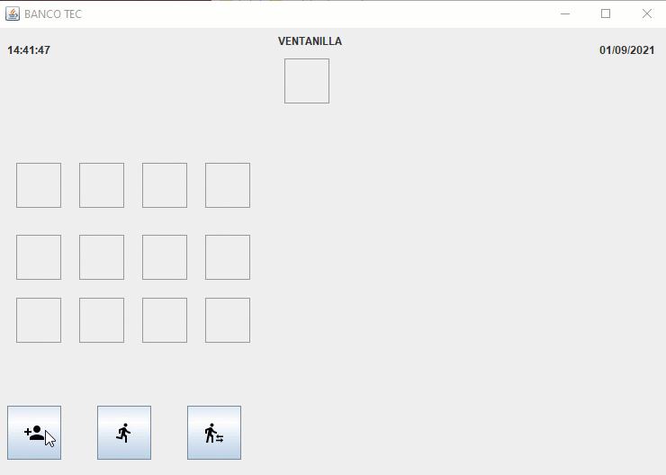
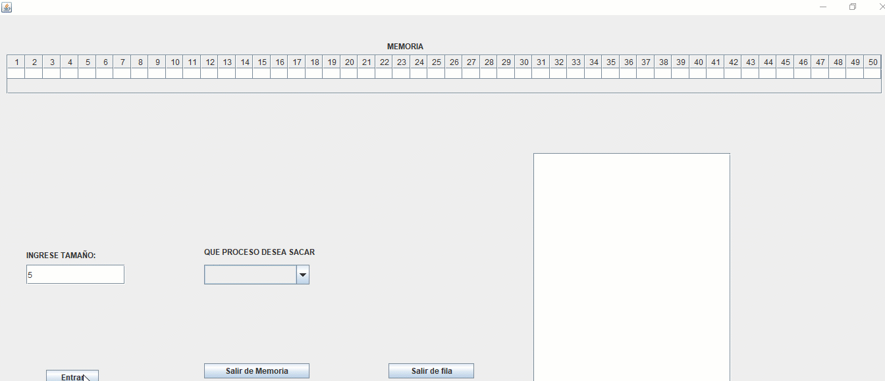
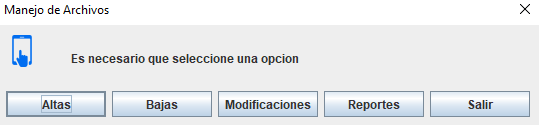
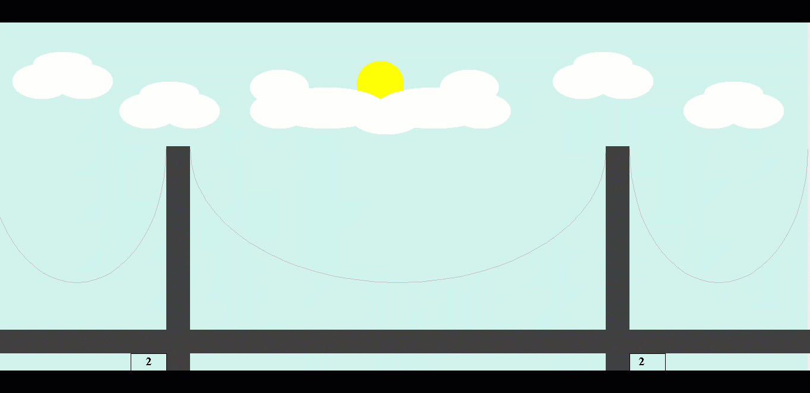

# 🖥️ Proyectos Java - ISC

Colección de proyectos desarrollados en Java como parte de la materia **Sistemas Operativos** en la carrera de Ingeniería en Sistemas Computacionales. Cada proyecto simula distintos aspectos del funcionamiento de un sistema operativo, desde la gestión de procesos hasta la comunicación entre equipos en red.

---

## ⚙️ Simulación de Procesos

### 🏦 [Simulación de Banco](Proyecto1BancoTec)  
Simulación de atención en ventanilla bancaria. Se modela el flujo de clientes con tiempos de **llegada**, **atención** y **salida**, utilizando estructuras de datos para representar la cola de espera.

  

---

### 🧠 [Gestión de Memoria](Proyecto2Memoria)  
Simulación de asignación de procesos en memoria. Se representa cómo los procesos se cargan, ejecutan y liberan espacio, aplicando técnicas básicas de administración de memoria.

  

---

### 🗂️ [Comunicación por Archivos](Proyecto3Archivos)  
Implementación de una red local entre dos equipos para intercambiar datos mediante archivos `.txt`. Se simula la escritura y lectura de archivos como medio de comunicación entre procesos distribuidos.

  

---

### 🖨️ [Simulación de Semáforo en Impresoras](Proyecto4Semaforo)  
Modelo de concurrencia utilizando semáforos para gestionar una pila de tareas de impresión. Se simula el acceso controlado a recursos compartidos por múltiples procesos.

---

## 📚 Tecnologías y Conceptos Aplicados

- Lenguaje: **Java**
- Paradigmas: **Programación orientada a objetos**, **concurrencia**
- Conceptos de SO: **Gestión de procesos**, **memoria**, **archivos**, **sincronización**
- Herramientas: **Sockets**, **Threads**, **Estructuras de datos**

---

## 🚀 Autor  

Desarrollado por Luis Manuel Tapia como parte del curso de <strong>Sistemas Operativos</strong> en el Instituto Tecnológico de Celaya.

